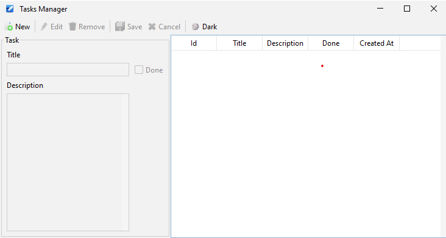

# **Task Manager Desktop App**

This desktop application was developed to put into practice what I have been learning about Java SE





This desktop application was built with the following technologies

* **Java**    
   * *Java SE*
   * *Java Swing*
* **Maven**
   * *Dependencies*
      * *SQLite-JDBC*
      * *JUnit*
      * *Flatlaf (Look and feel)*
* **SQLite**

------------------------------------------------


## **Installation**

In case you would like to modify the source code or contribute

## **Download**
```
git clone ...
```

## **Project Structure**

```
/controllers
   - Controller (Interface)
   - TaskController (Handle Events)
/dao
   /sqlite
      - SQLiteDAOFactory (SQLiteDAO Implementation)
      - SQLiteTaskDAO (TaskDAO Implementation)
   - DAO (Abstract DAO)
   - DAOFactory
   - TaskDAO (Abstract TaskDAO)
/models
   - Model (Interface)
   - Task (Entity)
/views
   /verifiers
      - TitleVerifier (Validation for JTextField)
      - DescriptionVerifier (Validation for a JTextArea)
   /task
      - TaskPanel (Panel for creating tasks)
      - TaskAdapter (JTable)
      - Task (JFrame)
```

## **Maven Lifecycle**

With running the following line you can ensure the project has all necessary information.

### **Validate**
With running the following line you can ensure the project has all necessary information.
```
mvn validate
```
### **Compile**

To compile the source code of the project

```
mvn compile
```
### **Test**

The tests are about making sure a task can be created, updated, deleted, and retrieved.

```
mvn test
```